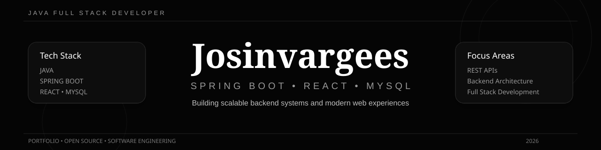
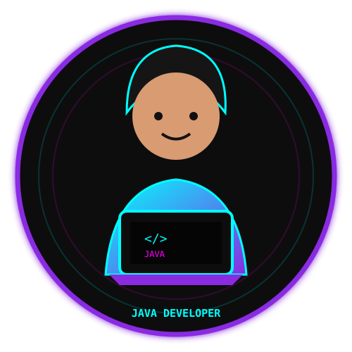

<div align="center">



<br><br>


<br><br>


</div>

---

# 👋 Hello, I'm Josin Vargees

<div align="center">

### 💻 Java Full Stack Developer

**Java • Spring Boot • React • MySQL • REST API**

</div>

---

## 👨‍💻 About Me



- 🎓 Computer Science Engineering Student
- 💻 Java Full Stack Developer
- ☕ Passionate about Java
- 🌱 Currently improving Spring Boot
- ⚛️ Building React applications
- 🗄️ Working with MySQL
- 🔐 Interested in Cyber Security
- 🚀 Building real-world applications
- 📚 Learning Data Structures & Algorithms
- 🔧 Using Git and GitHub for development

<br clear="right"/>

---

# 🛠️ Tech Stack

## 💻 Programming Languages

<p align="center">


</p>

---

## ⚙️ Backend Development

<p align="center">


</p>

<p align="center">


</p>

---

## 🎨 Frontend Development

<p align="center">


</p>

<p align="center">


</p>

---

## 🗄️ Database

<p align="center">


</p>

---

## 🔧 Tools

<p align="center">


</p>

---

# 📊 GitHub Statistics

<div align="center">


</div>

---

# 🔥 GitHub Streak

<div align="center">


</div>

---

# 🏆 GitHub Trophies

<div align="center">


</div>

---

# 📈 GitHub Contribution Activity

<div align="center">


</div>

---

# 🚀 Featured Projects

## 🔐 URL SHIELD

### 🛡️ Intelligent URL Security Analysis System

URL Shield is a security-focused application designed to analyze URLs and identify potentially dangerous or suspicious websites.

### ✨ Features

```text
🔍 URL Analysis
🛡️ Risk Score Calculation
🌐 Domain Analysis
🔐 HTTPS Detection
🚨 Suspicious URL Detection
📊 Security Status
📈 Risk Analysis
🗄️ MySQL Storage
🔌 REST API
